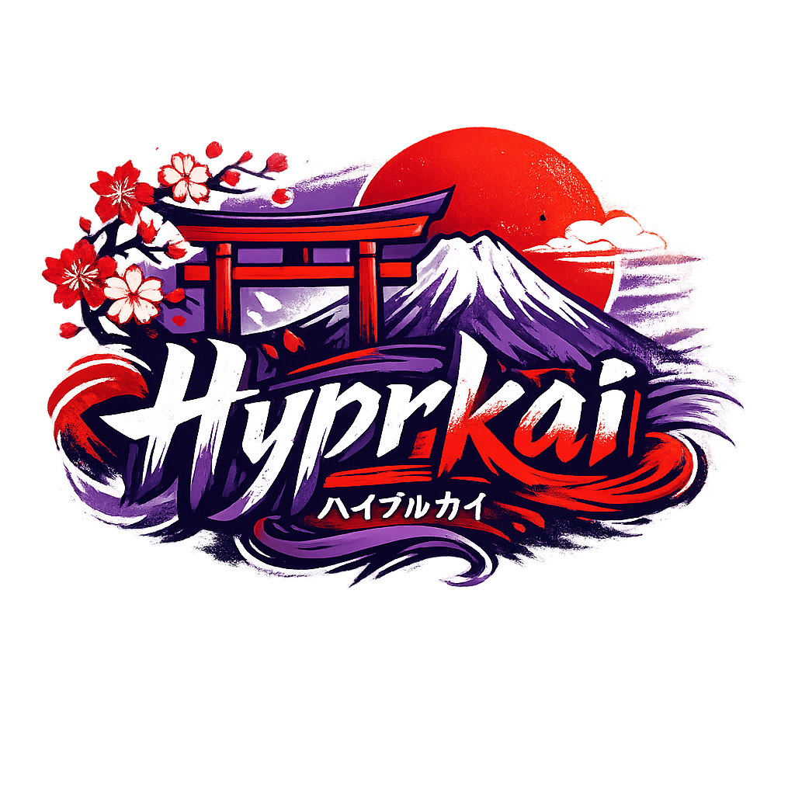
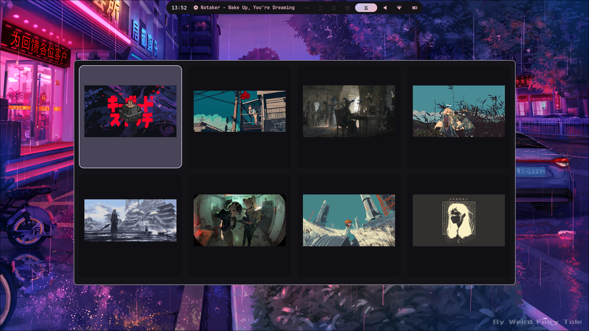
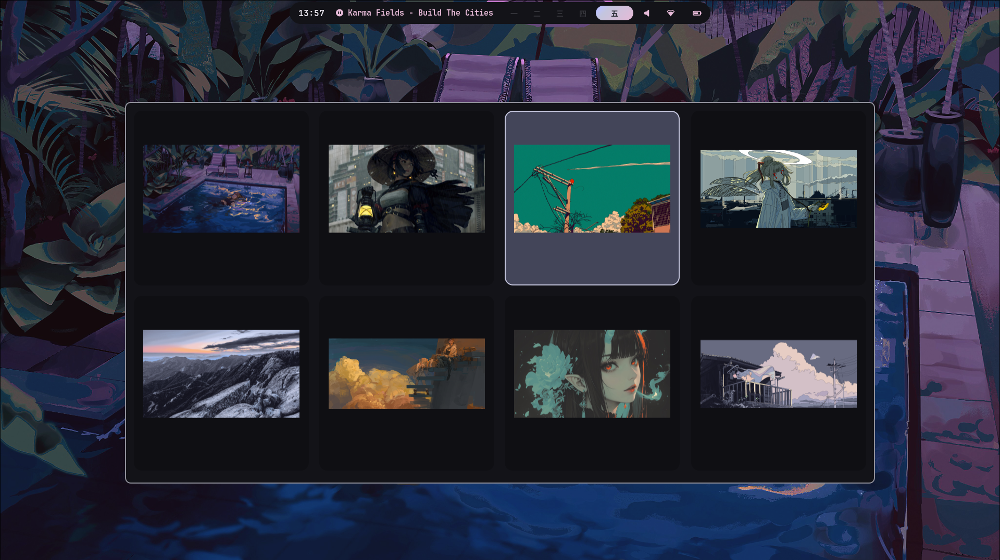
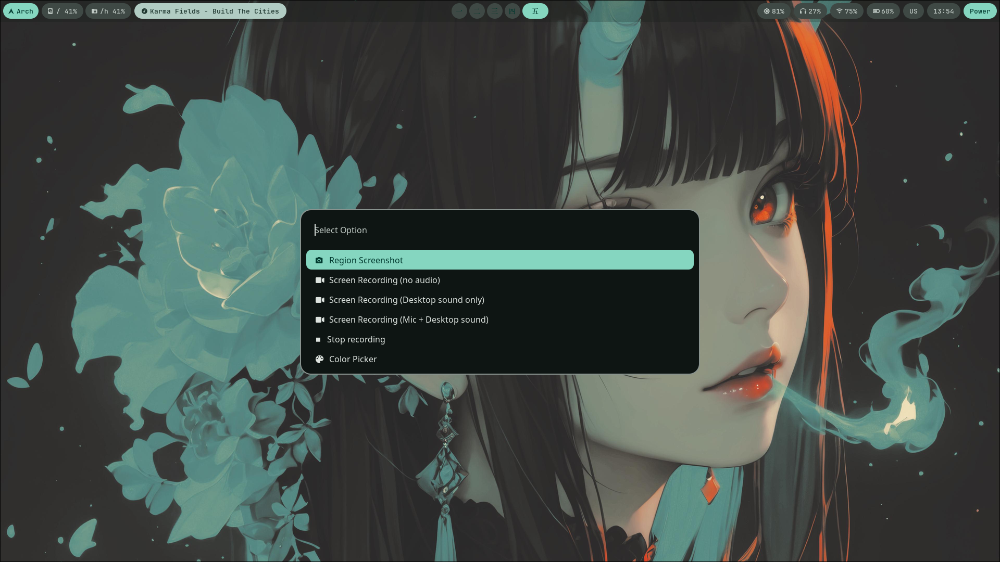
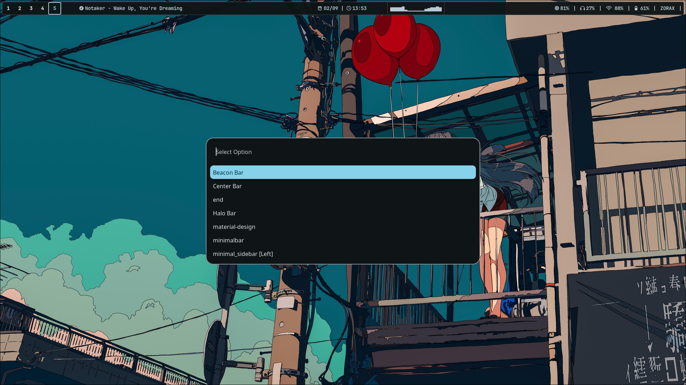
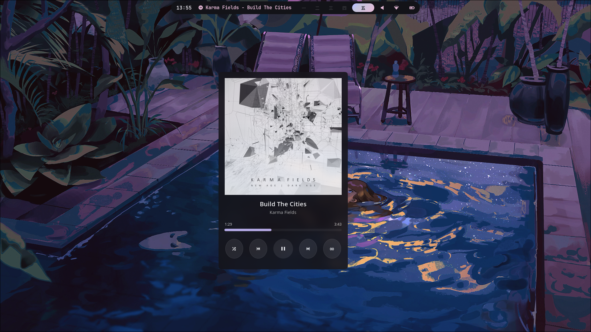
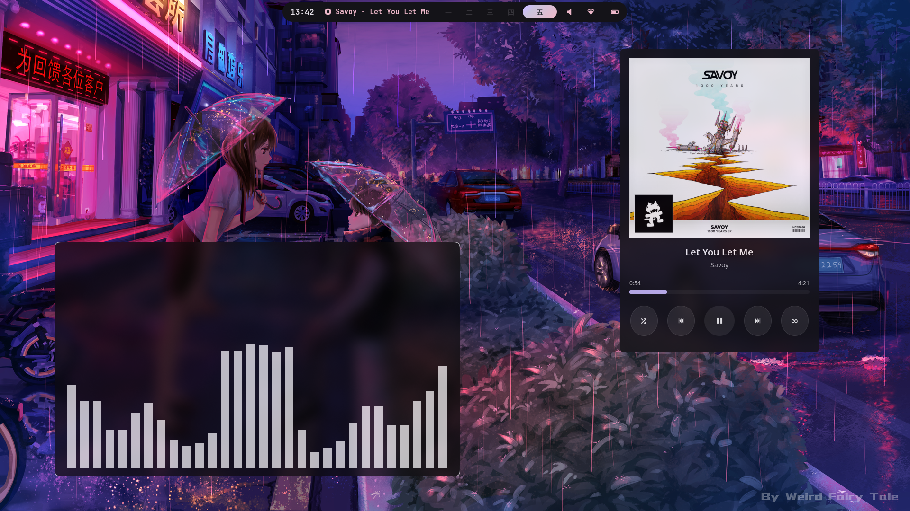
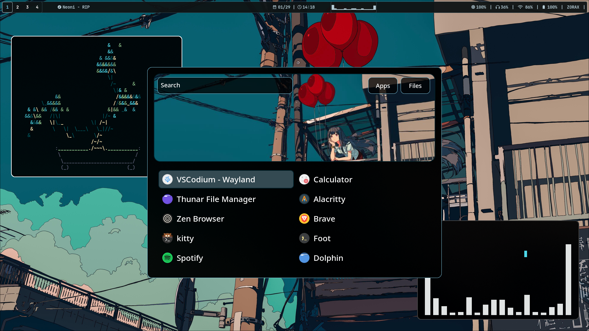

  

<table><tr>Wallpaper select</tr><tr><td>
</td><td>
</td></tr></table>

---

<table><tr><td>Tools</td><td>Waybar select</td></tr><tr><td>
</td><td>
</td></tr>
<tr><td>Media player</td><td>App launcher</td></tr><tr><td>
</td><td>
</td></tr>
</table>

soon

## Pakages used 
- Wofi
- Rofi
- Nvim (Lazyvim)
- Matugen
- Yt-x
- Waybar
- Alacritty
- kitty
- Fastfetch
- SwayNC
- Starship

## Key Binds
- **YOU WILL FIND ALL KEYBINDS IN hypr/binds.conf and for mangowc mango/binds.conf**
- Some Imp KEYBINDS 

| Keybind | Action |
|--------|--------|
| Super + ` | Open terminal | 
| Super + Q | Close window | 
| Super + A | App launcher | 
| Super + L | Wallpaper Switcher | 
| Super + B | Waybar Switcher |
| Super + Shift + S | Screenshot |

  

  

  

---

## Credits

Some files in this repository are adapted from **HyprKenso Dotfiles**
by Aadrito Basu.

Files used:
- syslauncher.sh
- hyprlock.sh
- hyprlock.conf

repository:
https://github.com/aadritobasu/HyprKenso

License: CC BY-NC-SA 4.0
